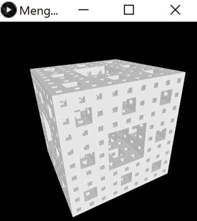

# Menger Sponge Fractal

## Table of Contents

- [Menger Sponge Fractal](#menger-sponge-fractal)
  - [Table of Contents](#table-of-contents)
  - [Description](#description)
    - [Display](#display)
      - [Examples](#examples)
    - [Folder structure](#folder-structure)
    - [Programming language(s)](#programming-languages)
  - [Installation](#installation)
  - [Usage](#usage)
    - [Invokation](#invokation)
    - [Operation](#operation)
  - [Contributions](#contributions)

## Description

This program provides an animation of a rotating Menger sponge fractal.  
Start date: September 05, 2019  
Current version: 0.1.0  

### Display

#### Examples

### Folder structure

| Tree with Root Having Local Path | Generation Method | Description |
| -------------------------------- | ----------------- | ----------- |
| <https://github.com/anderjef/Menger_Sponge_Fractal> | auto-generated by Processing | <!-- --> |
| [.github/](.github/) | <!-- --> | holds GitHub-specific documents |

### Programming language(s)

- Processing (Java)
  - [Menger_Sponge_Fractal.pde](Menger_Sponge_Fractal.pde)&mdash;main program entrance sets up canvas and executes animation steps
  - [Box.pde](Box.pde)&mdash;defines Box class/object

## Installation

- Download [ZIP](https://github.com/anderjef/Menger_Sponge_Fractal/archive/main.zip). Extract to a folder named Menger_Sponge_Fractal.
- Download and install [Processing 3 or compatible](https://processing.org/). Please understand that Processing may have bugs of its own.
- Open any of the Processing Source Code files with the Processing IDE (PDE).

## Usage

### Invokation

- See [Installation](#installation).
- Run the code from within the Processing IDE or export the application first.

### Operation

Click the display to increase the definition of the fractal. Use the up and down arrow keys to scale (up and down respectively) each box in the fractal. Use the left and right arrow keys to respectively lower and raise the amount by which the size of children boxes (generated upon click) are shrunk by. Use the f and s keys to speed up and slow down the rotation rate of the fractal, respectively. Review the exact variable values in the console. Sit back, relax, and enjoy! Note that simulation speed decreases exponentially with the number of simulated fractal levels.

## Contributions

- Jeffrey Andersen&mdash;developer
- [YouTube The Coding Train Video](https://www.youtube.com/watch?v=LG8ZK-rRkXo)&mdash;inspiration

For copyright, license, and warranty, see [LICENSE.md](LICENSE.md).
